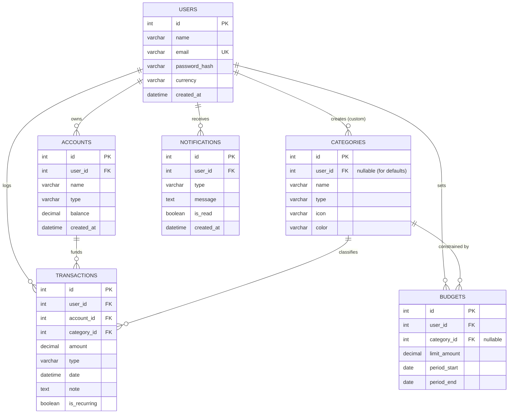

# Expense Tracker Application - Database Design

**Version:** 1.0  
**Prepared:** August 2026

---

## 1. Overview

The Expense Tracker Application utilizes a relational database to store user data, financial transactions, and related metadata.

* **Database Engine:** MySQL 8.0+
* **Character Set:** `utf8mb4` (to support full Unicode, including emojis for category icons)
* **Collation:** `utf8mb4_unicode_ci` (for accurate sorting and case-insensitive comparisons)
* **ORM:** Django ORM (Django 5.x+)
* **Architecture:** The database is designed for a multi-tenant personal finance application where data is strictly isolated per user via foreign key relationships.

The Django ORM handles the abstraction of SQL queries and schema management, but the underlying MySQL schema is designed with robust constraints and indexing to ensure data integrity and high performance.

---

## 2. Entity-Relationship Diagram



---

## 3. Table Definitions

### 3.1 `users`
Stores registered user accounts and their preferences.

| Column Name | Data Type | Constraints | Description |
|---|---|---|---|
| `id` | INT | PK, AUTO_INCREMENT | Unique identifier for the user |
| `name` | VARCHAR(150) | NOT NULL | Full name of the user |
| `email` | VARCHAR(254) | NOT NULL, UNIQUE | User's email address (login credential) |
| `password_hash` | VARCHAR(255) | NOT NULL | Bcrypt/Argon2 hashed password |
| `currency` | VARCHAR(3) | NOT NULL, DEFAULT 'USD' | Default ISO 4217 currency code |
| `created_at` | DATETIME | NOT NULL, DEFAULT CURRENT_TIMESTAMP | Account creation timestamp |

### 3.2 `accounts`
Stores financial accounts/wallets belonging to a user.

| Column Name | Data Type | Constraints | Description |
|---|---|---|---|
| `id` | INT | PK, AUTO_INCREMENT | Unique identifier for the account |
| `user_id` | INT | FK, NOT NULL | Reference to `users(id)` |
| `name` | VARCHAR(100) | NOT NULL | Name of the account (e.g., "Main Checking") |
| `type` | VARCHAR(20) | NOT NULL | Account type (cash, bank, card, wallet) |
| `balance` | DECIMAL(12,2) | NOT NULL, DEFAULT 0.00 | Current balance |
| `created_at` | DATETIME | NOT NULL, DEFAULT CURRENT_TIMESTAMP | Account creation timestamp |

*FK Constraint:* `FOREIGN KEY (user_id) REFERENCES users(id) ON DELETE CASCADE`

### 3.3 `categories`
Stores default and user-specific transaction categories.

| Column Name | Data Type | Constraints | Description |
|---|---|---|---|
| `id` | INT | PK, AUTO_INCREMENT | Unique identifier for the category |
| `user_id` | INT | FK, NULL | Reference to `users(id)`. NULL means it's a global default category. |
| `name` | VARCHAR(100) | NOT NULL | Category name (e.g., "Groceries") |
| `type` | VARCHAR(10) | NOT NULL | 'income' or 'expense' |
| `icon` | VARCHAR(50) | NULL | Icon identifier or emoji |
| `color` | VARCHAR(7) | NULL | Hex color code (e.g., '#FF5733') |

*FK Constraint:* `FOREIGN KEY (user_id) REFERENCES users(id) ON DELETE CASCADE`

### 3.4 `transactions`
Stores individual income and expense records.

| Column Name | Data Type | Constraints | Description |
|---|---|---|---|
| `id` | INT | PK, AUTO_INCREMENT | Unique identifier for the transaction |
| `user_id` | INT | FK, NOT NULL | Reference to `users(id)` |
| `account_id` | INT | FK, NOT NULL | Reference to `accounts(id)` |
| `category_id` | INT | FK, NOT NULL | Reference to `categories(id)` |
| `amount` | DECIMAL(12,2) | NOT NULL | Transaction amount (must be > 0) |
| `type` | VARCHAR(10) | NOT NULL | 'income' or 'expense' |
| `date` | DATETIME | NOT NULL | Date and time of the transaction |
| `note` | TEXT | NULL | Optional description or note |
| `is_recurring`| BOOLEAN | NOT NULL, DEFAULT FALSE | Flag for recurring transactions |

*FK Constraints:* 
- `FOREIGN KEY (user_id) REFERENCES users(id) ON DELETE CASCADE`
- `FOREIGN KEY (account_id) REFERENCES accounts(id) ON DELETE RESTRICT`
- `FOREIGN KEY (category_id) REFERENCES categories(id) ON DELETE RESTRICT`

### 3.5 `budgets`
Stores user-defined spending limits.

| Column Name | Data Type | Constraints | Description |
|---|---|---|---|
| `id` | INT | PK, AUTO_INCREMENT | Unique identifier |
| `user_id` | INT | FK, NOT NULL | Reference to `users(id)` |
| `category_id` | INT | FK, NULL | Reference to `categories(id)`. NULL means overall budget. |
| `limit_amount`| DECIMAL(12,2) | NOT NULL | Maximum spending amount |
| `period_start`| DATE | NOT NULL | Start date of the budget period |
| `period_end` | DATE | NOT NULL | End date of the budget period |

*FK Constraints:*
- `FOREIGN KEY (user_id) REFERENCES users(id) ON DELETE CASCADE`
- `FOREIGN KEY (category_id) REFERENCES categories(id) ON DELETE CASCADE`

### 3.6 `notifications`
Stores system alerts and budget warnings for users.

| Column Name | Data Type | Constraints | Description |
|---|---|---|---|
| `id` | INT | PK, AUTO_INCREMENT | Unique identifier |
| `user_id` | INT | FK, NOT NULL | Reference to `users(id)` |
| `type` | VARCHAR(50) | NOT NULL | E.g., 'budget_alert', 'reminder' |
| `message` | TEXT | NOT NULL | Notification content |
| `is_read` | BOOLEAN | NOT NULL, DEFAULT FALSE | Read status flag |
| `created_at` | DATETIME | NOT NULL, DEFAULT CURRENT_TIMESTAMP | When the notification was triggered |

*FK Constraint:* `FOREIGN KEY (user_id) REFERENCES users(id) ON DELETE CASCADE`

---

## 4. Django Model Mapping

The database schema maps directly to Django models within the `core` app (or a split structure like `users` and `finance` apps).

### Django Models (App: `finance`)

```python
from django.db import models
from django.contrib.auth.models import AbstractUser

# Extends the default Django User model
class User(AbstractUser):
    currency = models.CharField(max_length=3, default='USD')
    # email is inherited but should be set to unique=True in Django user management

class Account(models.Model):
    ACCOUNT_TYPES = (
        ('cash', 'Cash'),
        ('bank', 'Bank Account'),
        ('card', 'Credit/Debit Card'),
        ('wallet', 'Digital Wallet'),
    )
    user = models.ForeignKey(User, on_delete=models.CASCADE, related_name='accounts')
    name = models.CharField(max_length=100)
    type = models.CharField(max_length=20, choices=ACCOUNT_TYPES)
    balance = models.DecimalField(max_digits=12, decimal_places=2, default=0.00)
    created_at = models.DateTimeField(auto_now_add=True)

class Category(models.Model):
    TRANSACTION_TYPES = (
        ('income', 'Income'),
        ('expense', 'Expense'),
    )
    user = models.ForeignKey(User, on_delete=models.CASCADE, null=True, blank=True, related_name='custom_categories')
    name = models.CharField(max_length=100)
    type = models.CharField(max_length=10, choices=TRANSACTION_TYPES)
    icon = models.CharField(max_length=50, null=True, blank=True)
    color = models.CharField(max_length=7, null=True, blank=True)

class Transaction(models.Model):
    TRANSACTION_TYPES = (
        ('income', 'Income'),
        ('expense', 'Expense'),
    )
    user = models.ForeignKey(User, on_delete=models.CASCADE, related_name='transactions')
    account = models.ForeignKey(Account, on_delete=models.PROTECT, related_name='transactions')
    category = models.ForeignKey(Category, on_delete=models.PROTECT, related_name='transactions')
    amount = models.DecimalField(max_digits=12, decimal_places=2)
    type = models.CharField(max_length=10, choices=TRANSACTION_TYPES)
    date = models.DateTimeField()
    note = models.TextField(null=True, blank=True)
    is_recurring = models.BooleanField(default=False)

class Budget(models.Model):
    user = models.ForeignKey(User, on_delete=models.CASCADE, related_name='budgets')
    category = models.ForeignKey(Category, on_delete=models.CASCADE, null=True, blank=True, related_name='budgets')
    limit_amount = models.DecimalField(max_digits=12, decimal_places=2)
    period_start = models.DateField()
    period_end = models.DateField()

class Notification(models.Model):
    user = models.ForeignKey(User, on_delete=models.CASCADE, related_name='notifications')
    type = models.CharField(max_length=50)
    message = models.TextField()
    is_read = models.BooleanField(default=False)
    created_at = models.DateTimeField(auto_now_add=True)
```

---

## 5. Indexing Strategy

To support the NFR of sub-2-second loads for users with up to 10,000 transactions, the following indexes will be created:

1. **Primary Keys:** Auto-indexed by MySQL (id).
2. **Foreign Keys:** Auto-indexed by Django/MySQL (`user_id`, `account_id`, `category_id`).
3. **Unique Index:**
   - `users.email`: Ensures unique accounts and speeds up authentication lookups.
4. **Composite Indexes (Django `class Meta: indexes`):**
   - `transactions (user_id, date)`: Essential for retrieving a user's transaction history sorted by date, or filtering by a date range (dashboard generation).
   - `transactions (user_id, category_id)`: Speeds up aggregation queries for category-wise spending charts.
   - `budgets (user_id, period_start, period_end)`: Speeds up finding the active budget for a user's current session.

*Rationale:* The primary query patterns in the application are user-scoped. All major queries filter `WHERE user_id = X`, followed by date ranges or categories. Indexing these combinations drastically reduces scan times.

---

## 6. Data Integrity Rules

1. **Foreign Key Constraints:**
   - Deleting a user `CASCADES` to delete all their accounts, categories, transactions, budgets, and notifications.
   - Deleting a category or account is `PROTECTED` (or `RESTRICT` in MySQL) if there are existing transactions tied to it. A user must reassign or delete the transactions first to maintain financial history integrity.
2. **Check Constraints:**
   - `amount > 0` on `transactions` table. Amounts are stored as absolute values; the `type` field dictates if it's additive or subtractive.
   - `limit_amount > 0` on `budgets`.
3. **Unique Constraints:**
   - `email` on `users` table must be strictly unique.
   - (Optional but recommended): UNIQUE on `(user_id, name, type)` in `categories` to prevent a user from creating duplicate category names.

---

## 7. Seed Data

When the application is deployed, or when a new user registers, the following global default categories (`user_id` = NULL) should be seeded into the `categories` table:

| Name | Type | Icon (emoji/string) | Color |
|---|---|---|---|
| Salary | income | 💰 | #2ECC71 |
| Freelance | income | 💻 | #27AE60 |
| Groceries | expense | 🛒 | #E74C3C |
| Rent | expense | 🏠 | #8E44AD |
| Transport | expense | 🚌 | #3498DB |
| Entertainment | expense | 🍿 | #F1C40F |
| Utilities | expense | ⚡ | #E67E22 |
| Healthcare | expense | ⚕️ | #E74C3C |
| Shopping | expense | 🛍️ | #9B59B6 |
| Dining | expense | 🍽️ | #D35400 |
| Education | expense | 📚 | #2980B9 |
| Other | expense | 📦 | #95A5A6 |

---

## 8. Migration Strategy

* **Tooling:** Django's built-in migration framework (`makemigrations`, `migrate`).
* **Workflow:** All schema changes must be modeled in Django `models.py` first. Direct SQL structural modifications are prohibited.
* **Naming Conventions:** Migrations are auto-numbered by Django (e.g., `0001_initial.py`, `0002_add_transaction_note.py`). Keep names descriptive.
* **Rollback Approach:** Test migrations thoroughly in staging. Keep data migrations (data transformations) separate from schema migrations. Django allows rolling back using `./manage.py migrate app_name migration_number`. Ensure `models.PROTECT` is used carefully so downgrading doesn't drop vital financial data unexpectedly.

---

## 9. Backup & Recovery

* **Daily Backups:** Automated daily logical backups using `mysqldump` exported to a secure cloud storage bucket (e.g., AWS S3).
* **Point-in-Time Recovery (PITR):** Enable MySQL binary logging (`log_bin`) to allow recovery to a specific minute in case of accidental data loss.
* **Retention Policy:** Keep daily backups for 30 days, weekly backups for 3 months, and monthly backups for 1 year.
* **Restore Testing:** Conduct quarterly disaster recovery drills to ensure backups can be restored into a staging environment within 2 hours.

---

## 10. Performance Considerations

* **Query Optimization:** Use Django's `.select_related('account', 'category')` when fetching transactions to prevent the N+1 query problem, avoiding hundreds of separate DB hits for foreign keys.
* **Denormalization Decision (Account Balance):** Account balances are stored directly on the `accounts` table (`balance` column) rather than calculating `SUM(income) - SUM(expense)` on the fly every time. This requires updating the balance via Django signals or database triggers whenever a transaction is created, updated, or deleted. This vastly improves dashboard load times.
* **Pagination:** Endpoints serving the `transactions` list will implement cursor or limit/offset pagination. Returning more than 100 rows at once is prohibited to maintain memory safety and fast API response times.
* **Decimal Math:** Use MySQL `DECIMAL(12,2)` over `FLOAT` or `DOUBLE` to prevent floating-point precision loss during financial aggregations. Django's `DecimalField` translates perfectly to this and ensures safe arithmetic in Python using the `decimal` module.
